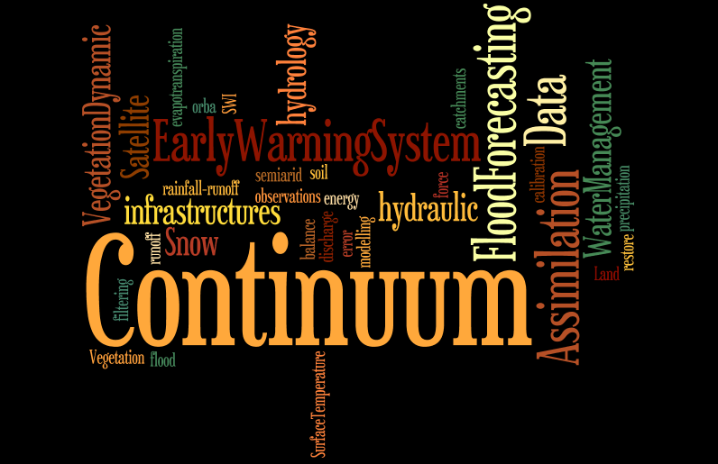
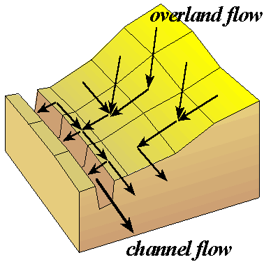
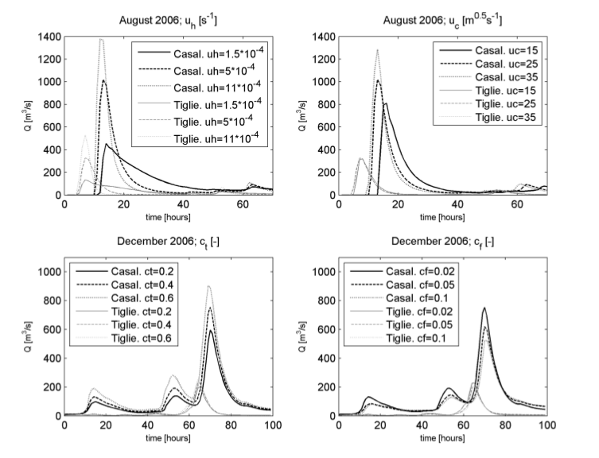
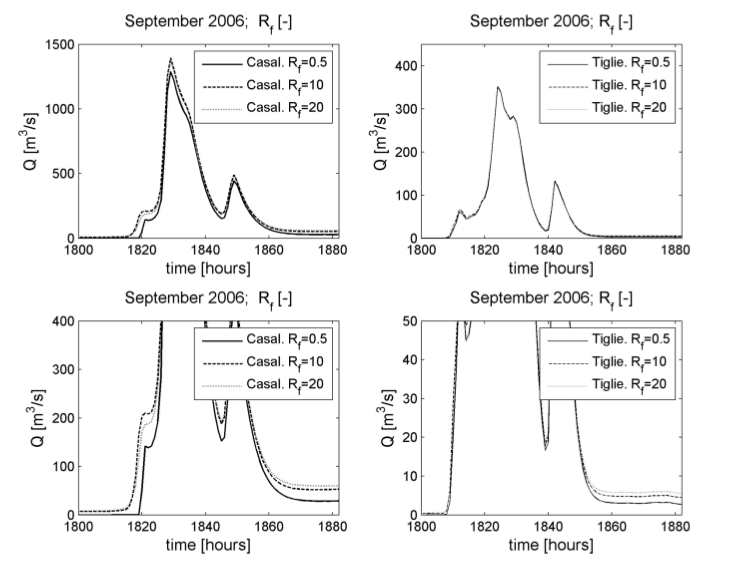
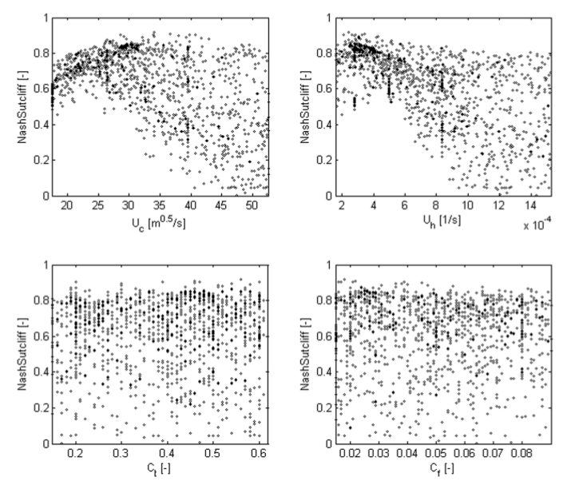

===========
Description
===========

Introduction
************

Continuum is a continuous distributed hydrological model, usually named HMC, that strongly relies on a 
morphological approach, based on a novel way for the drainage network components identification.
The model is a compromise between models with a strong empirical connotation, which 
are easy to implement but far from reality, and complex physically based models which 
try to reproduce the hydrological processes with high detail but which introduce a 
hard parameterization and consequent uncertainty and lack of robust parameters identification.

The HMC aims at an equilibrium between simplicity and rigorous physical 
modeling while maintaining comparable performances to existing models; the reduced 
complexity of the schematizations and the relatively small number of parameters leads 
to a considerably lower calibration effort, increasing model robustness and portability 
to data scarce environments. The resulting increased computational efficiency leads to 
an easier utilization of the model in ensemble mode so that a direct quantification of 
prediction uncertainties is possible. All the main hydrological phenomena are modeled in a 
distributed way. Nowadays satellite products of meteorological, hydrological 
and “vegetation” variables are becoming promising and widely available all over the world. Examples of 
meteorological satellite products are: TRMM evapotranspiration estimations, H-SAF soil moisture.
These kind of data are now available for a high percentage of the earth’s surface. 
This leads to a panorama where the possibility of running a hydrologic model using only 
satellite information is real. Along these lines develops one of the most important features 
of the HMC: it can be calibrated using only satellite data, e.g. surface temperature 
and/or soil moisture; results in reproducing observed discharge in this framework are quite promising. 
This makes the model suitable for application in data scarce environments.

The model is able to reproduce the spatial-temporal evolution of soil moisture, energy fluxes, 
surface soil temperature and evapotranspiration. Moreover, it can account for seasonal vegetation 
variability in terms of interception and evaporation. Deep flow and water table evolution are 
modelled with a simple scheme that reproduces the main physical characteristics of the process 
and a distributed interaction between water table and soil surface with a low level of 
parameterization. The introduction of the so-called “force-restore” equation for the surface 
energy balance allows the LST estimation and makes the model feasible to exploit remote sensing data. 
These latter can be used for calibration or, more appropriately, in a data assimilation framework.
Referring to already tested calibration methodologies and making some basic assumptions, the 
calibration task can be reduced to just six parameters at catchment scale that are then spatially 
distributed by means of simple assumptions  on the physical processes that they describe. 
Consequently, the parameter space is really small for a distributed continuous model, and HMC can 
be implemented with easily accessible data and territorial information (digital elevation model, 
basic soil and vegetation parameters). If more detailed territorial information were available, 
the parameterization methodology could be approached reducing the number of assumptions and linking 
the parameters more tightly to territorial characteristics.
The sensitivity analysis has been carried out on five parameters: two parameters regulate the 
overland flow, the shape of the hydrograph and response time; two parameters are related to 
the soil characteristics and affect infiltration and relative soil humidity; and one parameter 
takes into account soil porosity and the ratio between vertical and horizontal saturated soil conductivity.
A nice separation can be found between parameters in the fact that they influence quite distinct 
response of the model, with the result of further simplifying the calibration procedure. Standard 
calibration and validation based on streamflow data have been carried out on different periods and 
on different outlet sections (in terms of soil use, slope and response time). The model produces 
good results in terms of discharge. Further work is needed to introduce the modelling of the snow 
cover evolution and of the snowmelt in order to carry out multi-annual simulations where data are 
available. Model initialization influences the simulation for quite a long period; in particular 
the definition of initial water table level is a sensitive choice. The ideal situation is to extend as far as 
possible the warm-up period, including a long period without rainfall events. 
			
.. figure:: img/hmc_generic/hmc_hydro_casalcermelli_2008.png 
    :height: 1200px
    :width: 1200px
    :scale: 50 %
    :alt: HMC hydrograph at Casalcermelli 2008
    :align: center

The water table initialization methodology here is based on a possible spatial distribution of water 
table that exploits morphological constraints. Further validation analysis has been carried out 
comparing LST estimated by the model and satellite measurements at both pixel and basin scale. 
The results provide evidence that HMC reliably models the LST dynamics at various temporal scales, 
with some periods of overestimation, particularly during the warmer hours of summer. During the cold 
season the modelled LST has a lower variability with respect to the satellite estimates, but here 
the percentage of reliable data is quite scarce because of the more frequent cloud covering, and 
this makes the comparison more uncertain. The approach followed in the design of HMC 
proposes concentrating the efforts in augmenting the number of state variables that are predicted 
by the model and those that are also observables by using classical or remote instruments of measure. 
Specific attention is paid to distributed variables (e.g. LST fields) that offer very different 
information when compared to integral measures (e.g. discharge time series). The LST comparison 
showed potential for additional constraints to be used in the calibration phase or to be 
exploited in a more comprehensive assimilation framework. The distributed nature of the LST in 
comparison to traditional calibration time series (e.g. discharge data series) can add important 
information for a better estimation of state variables and parameter patterns. 
A demonstration of this potential is carried out by calibrating a sub-set of the parameters referring to LST satellite 
estimation and to morphologic information derived by the DEM. The results are comforting, and the 
proposed methodology led to a parameter set that well reproduces both satellite LST and streamflow 
observations, the latter used only in the validation phase. LST was successfully used to drive the 
calibration procedure. This was possible thanks to the model structure and the way parameters 
are treated and distributed in time and space. This could have a strong application impact in environments 
where reliable streamflow data are not available, given the worldwide availability of LST data.

Overland channel flow
*********************

The surface flow schematization distinguishes between channel and hillslope flow. In channels the momentum 
equation per unit of width is derived from the kinematic schematization with a nonlinear dependence between 
discharge and water velocity. The water depth for the i-th channel cell is evaluated combining the momentum 
equation and the mass balance equation:

.. math::

	\frac{dh_i}{dt} = I_i - \frac{1}{\Delta x} \cdot{u_c} \cdot \sqrt{tg(\beta_i)} \cdot{h^{1.5}_i}

where :math:`I_i` represents the input per unit of area (the sumof runoff, saturation excess and inow 
discharge from upstream) to the grid cell [L T −1 ].
On the hillslopes the overland ow has a linear equation for the motion:

.. math::
	
	q = \Delta x \cdot u_h \cdot h_i

where :math:`u_h` parameterizes the main morphologic characteristics of the hillslopes [T −1 ] (slope, roughness, etc.). 
The nal schematization is equivalent to a linear reservoir model. The parameters :math:`u_h` and :math:`u_c` 
need calibration at basin scale (i.e. one value for the entire catchment).
In both hillslopes and channels, the re-infiltration process is accounted for: the input to the i-th cell must exceed its
infiltration capacity; otherwise, it infiltrates the soil. Exfiltration is also possible.

Vegetation interception
***********************

Interception includes the portion of rainfall that is caught by tree leaves, grass and vegetation 
cover in general, and is evaporated before it touches the ground. 

.. figure:: img/hmc_generic/hmc_example_vegetation_interception.png
    :height: 500px
    :width: 500px
    :scale: 50 %
    :alt: HMC vegetation interception example
    :align: left

Ponding effects are also included in this initial abstraction. Interception is modelled by a simple empirical equation.  
A maximum retention capacity :math:`S_v` is introduced, and it is estimated as a function of the leaf area index (LAI) 
by the relationship:

.. math::

	S_v = 0.95 + 0.5 \cdot LAI - 0.06 \cdot LAI^2

The water in the reservoir with capacity :math:`S_v` is evaporated at the evaporation rate derived by the 
latent heat flux estimation without affecting the infiltration computation; the input is the precipitation. 
The advantage of using a LAI-dependent expression is that the model takes into account vegetation variability 
in space and time. LAI is usually updated every 15 days from satellite optical sensor data (e.g. from MODIS).

Infiltration and Subsurface Flow
********************************

The infiltration methodology is a modification of the Horton equation based on physically interpretable parameters. 
It accounts for soil moisture evolution even in condition of intermittent and low-intensity rainfall (namely lower 
than the infiltration capacity of the soil). The soil is schematized as a reservoir with capacity :math:`V_{max}` [L], 
and a selective filter :math:`g(t)` [L T−1 ] manages the inflow:

.. math::

	g(t) = f_0 + (f_1 - f_0) + \frac{V(t)}{V_{max}}

where :math:`f_0` is the maximum infiltration rate for completely dry soils and :math:`f_1` is the asymptotic minimum 
infiltration rate for saturated soils considered as a function of :math:`f_0`:

.. math::
	
	f_1 = c_t \cdot f_0

The method proposed has been further modified by introducing the field capacity of the soil, defined as the water 
content that can be held by capillarity against the force of gravity:

.. math::

	V_{fc} = c_t \cdot V_{max}

with the parameter :math:`c_t` ∈ [0, 1]. In this configuration, the dynamic mass-balance equation for the soil can 
be written for each cell:

.. math::

	\frac{dV}{dt} = g(t) - r_p(t)

where:

.. math::

	r_p(t) = f_1 \cdot (V(t) - \frac{c_t \cdot V_{max}}{V_{max} \cdot (1 -c_t)} )

The infiltration scheme has four parameters: the initial infiltration rate :math:`f_0`, the maximum soil retention 
capacity :math:`V_{max}`, and the parameters to define soil field capacity :math:`c_t` and final infiltration rate :math:`c_f`. 

The parameters :math:`f_0` and :math:`V_{max}` are related to the soil type and land use through the curve number (CN) parameter. 
They can be easily derived by soil use and soil type maps and they vary spatially in the catchment; :math:`c_t` and :math:`c_f` 
are calibration parameters and are assumed to be constant for the whole basin. In this way the pattern of :math:`f_1` and :math:`V_{fc}` 
is spatially modulated by the pattern of :math:`V_{max}`. The percolation rate separates into two components: a contribution 
to subsurface flow :math:`r_{Hy}` and one to deep flow :math:`r_d` or recharging water table defined as:

.. math::

	r_{Hy} = sin(\alpha) \cdot r_p(t)

.. math::

	r_d = (1 - sin(\alpha)) \cdot r_p(t)

where the angle :math:`\alpha` is such that :math:`\tan(\alpha)` is the downslope index; :math:`sin(\alpha)` is a decomposition term 
that increases with the terrain slope, reproducing the major proneness of the high slope areas to subsurface flow due to gravity. 
The downslope index seems to be less sensitive than local surface slope to changes in DEM resolution, and it is able to capture 
dominant controls on local drainage regimes, especially in cases where profile curvature exerts a strong control on the drainage 
pattern. The subsurface flow is propagated between cells following the surface drainage network directions, and the soil moisture 
state of each cell is updated by considering both the infiltration, estimated by the modified Horton method, and the inflow 
from the upper cells. Therefore a cell can reach saturation because of the percolation from upper cells causing saturation excess.
The water in the reservoir with capacity :math:`S_v` is evaporated at the evaporation rate derived by the latent heat flux estimation 
without affecting the infiltration computation; the input is the precipitation. The advantage of using a LAI-dependent expression 
is that the model takes into account vegetation variability in space and time.

Deep Flow and Water Table
*************************

Several approaches are possible to describe the dynamics of both the deep flow and the water table, with examples from Darcy’s law 
applications to conceptual reservoir models. However, it is often difficult to have the data necessary for the correct implementation 
and parameterization of water table dynamics. In HMC the water table evolution is modelled with a simplified approach that maintains 
a physical and distributed description of the process. 

Above all we are interested in the water table interaction with the subsurface 
flow and soil surface and in its effects on surface flow and soil moisture spatial pattern; the adopted scheme allows also the 
reproduction of the baseflow far from rainfall events with a parsimonious parameterization. The layer of soil containing the aquifer 
is schematized as a unique homogeneous layer bounded by the lower impervious (bedrock) surface and the bottom of the root zone. 
The thickness of this layer is expressed in terms of maximum volume of water content of the aquifer, and it is estimated using the 
surface slope as a proxy. The maximum water content in every cell (i) of the basin is given by: 

.. math::

	VW_{mi} = VW_{max} \cdot \frac{\tan(\alpha_{max}) - \tan(\alpha_{i})}{\tan(\alpha_{max}) - \tan(\alpha_{min})}

where :math:`VW_{max}` is the absolute maximum water content of the aquifer on the whole investigated area; this sets a limit that 
is basically a calibration parameter. The reservoir is fed with rd (see previous section). The effect of porosity is considered 
as a multiplicative factor in the Darcy’s equation used to estimate the flux per unit area between two contiguous cells (i and j): 

.. math::

	q{_{ij}} = \frac{h{_{Wi}} - h{_{Wj}}}{\Delta{x}} \cdot R{_{f}} \cdot f{_{1i}}

where x is the DEM spatial resolution, f1i the final infiltration rate estimated, :math:`h_{w}` the water table level and :math:`R_{f}` 
a factor that also takes care of differentiating the saturated vertical and horizontal conductivity. Each cell can drain towards all 
the neighbouring cells following the 2-D water table gradient that depends on the elevation and on the water content of each cell. 
When the water table reaches the surface (:math:`VW_{i} = VW_{mi}`), the deep percolation term is inhibited, while the condition 
:math:`VW(t) ∼ 0` is a limit that can only be reached after a very long and anomalous dry period.

Energy Balance and Evapotranspiration
*************************************

The representation of surface mass and energy turbulent fluxes requires the solution of a conservation equation for mass and energy 
driven by temperature and moisture content. Since the vertical gradient of such variables is quite large, a high-resolution multiple 
layer model would be required to estimate soil surface temperature and moisture content with accuracy. Such an approach demands substantial 
amounts of computing resources to solve the balance equations. 

An alternative approach makes use of computationally efficient parameterization of soil heat and moisture flux terms. 
In other studies is showed that the heat flux into the soil could be parameterized by the sum of a temperature-derivative term and 
the difference between ground surface and  deep soil temperature. 
This approach is known as the “force-restore” method, because the forcing by net radiation is modified by a restoring term that contains 
the deep soil temperature. Since then the “force-restore” method has been widely used in land surface modelling. 
Some studies demonstrated that the “force-restore” equation is the solution of the heat diffusion equation, with purely sinusoidal forcing 
assuming that the thermal properties are constant with depth and the surface forcing term is also nearly independent of air temperature and 
has a strong periodic behaviour in time. The HMC solves a complete and explicit energy balance at the interface between soil surface and 
atmosphere by using the “force-restore” approach for land surface temperature. 
Theoretically, the control volume to which the balance is applied is the unit area bounded vertically by the surface of the soil 
and the top of the canopy, assuming the thermal capacity of this volume is negligible. The horizontal energy fluxes are neglected. 
In practice, the volume is extended to the unit cell of the numerical scheme used. This approximation is a fair trade-off between parsimony in parameterization and accuracy in the description of the processes.The conservation of energy at soil surface is given by:

.. math::

	G = R_n - H - LE

where :math:`R_n` is the net radiation, :math:`H` the sensible heat flux, :math:`LE` the latent heat flux and :math:`G` the ground 
flux (all [E t−1 L−2 ]). This latter term closes the budget, and it represents the heat propagated by diffusion towards the deep 
layers of the soil. The shortwave component of :math:`R_n` is derived from radiometer observations when the density of observations is 
appropriate. Otherwise, it is estimated by combining the extraterrestrial component of the radiation computed, attenuated using 
meteorological variables and cloud cover. The terrain parameter characterizations that influence both direct and diffuse components 
of the radiation are computed. The longwave components are rarely available from observations, and they are therefore estimated 
using the Stefan–Boltzmann law as a function of air temperature and humidity. The daily cycle of LST has the implicit signature of 
the energy balance. Maximum amplitudes of LST diurnal cycle are usually reached in the presence of bare and dry soil. The presence 
of moisture on the surface and in the subsurface soil greatly moderates the daily range of LST. The vegetation cover has a similar 
effect. The “force-restore” approach leads to the following equation for LST:

.. math::

	\frac{dLST}{dt} = 2 \cdot \sqrt{\pi \omega} \frac{(R{_{n}} - H - LE)}{\varphi} - 2\pi\omega \cdot(LST - T{_{deep}})

where :math:`\varphi` φ [E L−2 T−1 t−(1/2) ] is the effective thermal inertia and :math:`T_{deep}` [T] is a “restoring” deep ground 
temperature. :math:`T_{deep}` is evaluated by filtering data for air temperature at ground level; :math:`\varphi` is the thermal inertia, and 
it is a function of conductivity, density and specific heat capacity of soil, and it is eventually related to soil moisture. 
The fluxes are estimated using bulk formulations. The equation input variables are commonly observed by ground-based micrometeorological 
networks. The soil parameters used in the estimation of the thermal inertia, usually constant at basin scale, can be estimated by a 
data assimilation process, or related to soil type when reliable maps are available. In HMC the evapotranspiration :math:`LE` [m s−1] is 
estimated as:

.. math::

	ET = \frac{LE}{\rho{_{w}} \lambda{_{LE}}}

where :math:`\rho_{w}` [m L−3 ] is the water density, and :math:`ET` is deducted from the interception storage :math:`S_v` if not empty, 
otherwise from the subsurface reservoir :math:`V(t)` adding the following:

.. math::

	\frac{dS{_{v}}}{dt} = ET

if :math:`S_v` greater then 0 and:

.. math::

	\frac{dV}{dt} = ET

if :math:`S_v` greater equal 0.

Parameters
**********

Six model parameters need calibration on the basis of input–output time series: :math:`c_{f}`, :math:`c_{t}`, :math:`h_{h}`, :math:`u_{c}`, 
:math:`R_{f}`, :math:`VW_{max}`. The first two parameters :math:`c_{f}` and :math:`c_{t}` mainly rule the generation of runoff and the 
movement of water in the different soil layers, while :math:`u_{h}` and :math:`u_{c}` control the surface water motion. 
:math:`VW_{max}` represents the maximum storage capacity of the aquifer, and :math:`R_{f}` summarizes the effect of soil porosity 
as well as of the ratio between vertical and horizontal saturated soil conductivity. The range of variation of the parameters has 
been defined based on prior knowledge of the parameter meaning, which defines their mathematical and physical range of validity. 

.. table:: Summary of the model parameters that need calibration with their brief description
    :widths: auto
    
    +------------+------------+-----------------------------------------------------+
    | Parameters |    Units   |                     Description                     |
    +------------+------------+-----------------------------------------------------+
    |     uh     |    [s-1]   | Flow motion coefficient in hillslopes               |
    +------------+------------+-----------------------------------------------------+
    |     uc     | [m-0.5s-1] | Friction coefficient in channels                    |
    +------------+------------+-----------------------------------------------------+
    |     cf     |     [-]    | Defines the infiltration capacity at saturation     |
    +------------+------------+-----------------------------------------------------+
    |     ct     |     [-]    | Defines the mean field capacity                     |
    +------------+------------+-----------------------------------------------------+
    |     Rf     |     [-]    | Related to anisotropy between the vertical and      |
    |            |            | horizontal saturated conductivity, and to porosity  |
    +------------+------------+-----------------------------------------------------+
    |    VWmax   |    [mm]    | Maximum water capacity of the aquifer on the whole  |
    |            |            | investigated area                                   |
    +------------+------------+-----------------------------------------------------+

The parameters :math:`u_{c}` and :math:`u_{h}` impact the water flow on the surface. High values of these two parameters lead to 
narrow and highly peaked hydrographs; :math:`u_{h}` has influence on the general shape of the hydrograph while :math:`u_{c}` has 
an increasing influence with the increasing length of the channelled paths (e.g. large/elongated basins). It modifies the peak 
flow value as well as the peak arrival time. The impact estimation of parameters :math:`u_{h}` and :math:`u_{c}` has been made 
considering a short period of simulation (16 to 18 August 2006) since they influence directly the overland and channel flow. 
The first subplot in the following figure shows that :math:`u_{h}` has a considerable influence on both the Tiglieto and 
Casalcermelli outlets. 

The peak values and the hydrograph shape have quite a large range of variation, while peak times are not 
significantly affected by this parameter. The second subplot shows the influence of :math:`u_{c}`. It mainly affects the shape 
and the peak times on the Casalcermelli outlet section, while hydrographs of the Tiglieto outlet show negligible differences. 
Note that Casalcermelli has a drainage area that is one order of magnitude larger in respect to Tiglieto. The parameter :math:`c_{t}` 
is related to the soil field capacity and defines the fraction of water volume in the soil not available for percolation and 
subsurface flow. It has an impact on the dynamics of soil saturation between rain events: higher values of :math:`c_{t}` reduce the 
soil drying time scale especially during the cold season, with consequently higher runoff coefficients for single rainfall events. 
However, the subsurface flow tends to vanish rapidly, because water level drops easily under the field capacity. 
The parameter :math:`c_{f}` controls both the velocity of subsurface flow and the dynamics of saturation of the single cells. Low 
values of :math:`c_{f}` (i.e. low values saturated hydraulic conductivity) tend to cause the rapid saturation during rainfall events 
associated with slow subsurface flow increasing runoff production. Higher values of :math:`c_{f}` produce a rapid subsurface flow with 
saturated areas that quickly concentrate along the drainage network. The combination of the two soil parameters :math:`c_{t}` and 
:math:`c_{f}` controls the distribution of the volumes of soil and surface water in space and time, and it impacts soil humidity 
propagation; :math:`c_{t}` and :math:`c_{f}` influence the mass balance over long periods and regulate the exchanges between 
subsurface flow and runoff. The third and fourth panels in the previuous figure show how they affect the tails of the hydrographs and 
the values of peak flows in the period between 7 and 10 December 2006. The effect of the combination of these two parameters is quite 
complex, and it is only partially represented in the figures. They must be calibrated over long periods of time using, at best, external 
soil information when available.

The parameter :math:`R_{f}` regulates the response of the deep flow and mainly influences low flow regimes, while for larger basins it 
also affects high discharges. In the figure below the period between 14 and 17 September 2006 is shown. The effects of :math:`R_{f}` 
on the Tiglieto outlet are negligible during the flood while the influence on low flows is more relevant for both the outlet sections. 
Particular remarks need to be made about :math:`VW_{max}` – a measure of the capacity of the basin for storing water in its aquifer 
and deep soil layer. All these simulations highlighted another important feature of the model. 

Because of its internal structure, similarly to other complete hydrological models, it is possible to map different 
processes and therefore different parts of the hydrograph, onto the parameters, so that different parts of the hydrograph time 
series can be used separately to better identify model parameter values. Further analysis is needed to show sensitivity to spatial 
and temporal resolution.

It is not easy to define a value for :math:`VW_{max}` that reproduces a correct or realistic distribution of the deep soil layer water 
storage throughout the basin due to the fact that this distribution is hard to observe. Tests made using different values of :math:`VW_{max}`
in a physically acceptable range and starting from the same initial condition show that the model has low sensitivity to this parameter 
when the period of simulation covers between 6–12 months. This is related to the slow temporal dynamic of the water table. 

If data series for very long simulations (many years) are available, the parameter :math:`VW_{max}` can be re-calibrated and adjusted. 
In the adopted scheme the initialization of the related state variable :math:`VW(t)` is more important than its upper limit. In fact, 
practice demonstrates that the definition of the water table initial condition :math:`VW(t = 0)` evidently influences simulated 
discharge. A reasonable initial condition produces a rapid stabilization of the water table with dynamics driven by the water input from 
upper soil layer. Two considerations are made in order to define these: 

	* in correspondence with the drainage network, the water table is generally next to soil surface, because it is continuously recharged by the upstream portions of catchment;
	* the mountainous parts of the water table receive reduced contribution, because they drain small areas and are characterized by high gradients, and here the water table has lower levels. 

Based on these considerations, water table initial conditions are set as follows; :math:`VW(t = 0)`, in correspondence with channels, 
is set close to :math:`VW_{max}`. In the hillslopes the level of :math:`VW(t = 0)` is estimated supposing it is inversely proportional to the 
downslope index :math:`\alpha`. 

In order to carry out a basic sensitivity analysis, we considered what appear to be the most sensitive 
parameters (:math:`u_c`, :math:`u_h`, :math:`c_t`, :math:`c_f`) and a set of 2000 model runs has been generated using a Monte Carlo approach, 
sampling the parameters from a uniform distribution bounded by the parameter domain. 

The runs have been carried out on a sub-period of the 
calibration period where two major flood events occurred (July – September 2006). To show the results a dot plot representation has been 
drawn using the Nash–Sutcliffe coefficient (NS) as skill estimator. From figure above, it is possible to clearly identify a behavioural domain 
for :math:`u_h` and :math:`u_c`, while a lot of uncertainty in the streamflow simulation due to :math:`c_f` and :math:`c_t` is present. 
This could be due to the very nonlinear relationship that connects these last two parameters with streamflow.

